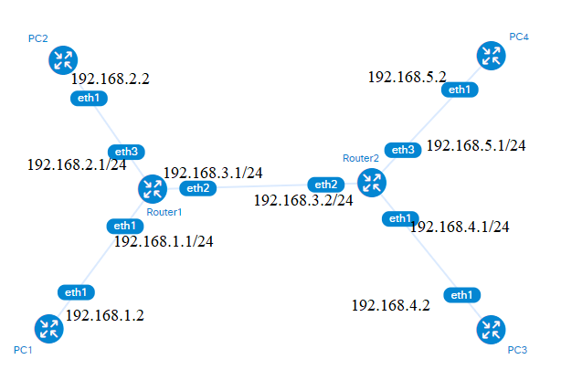
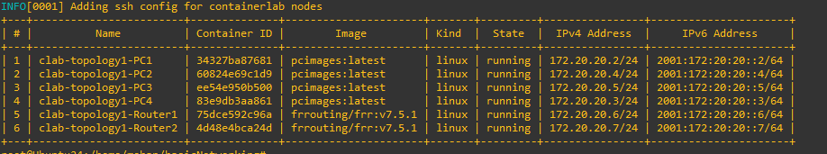
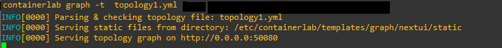
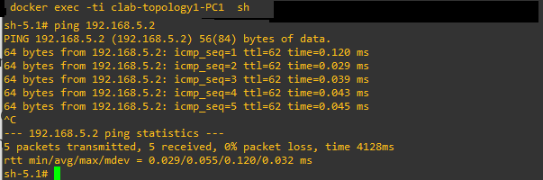
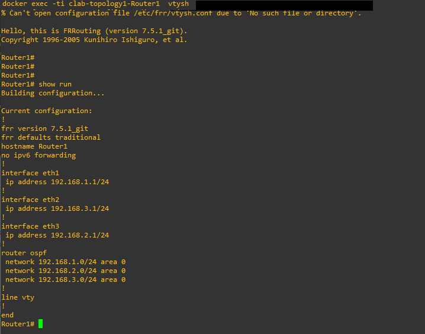
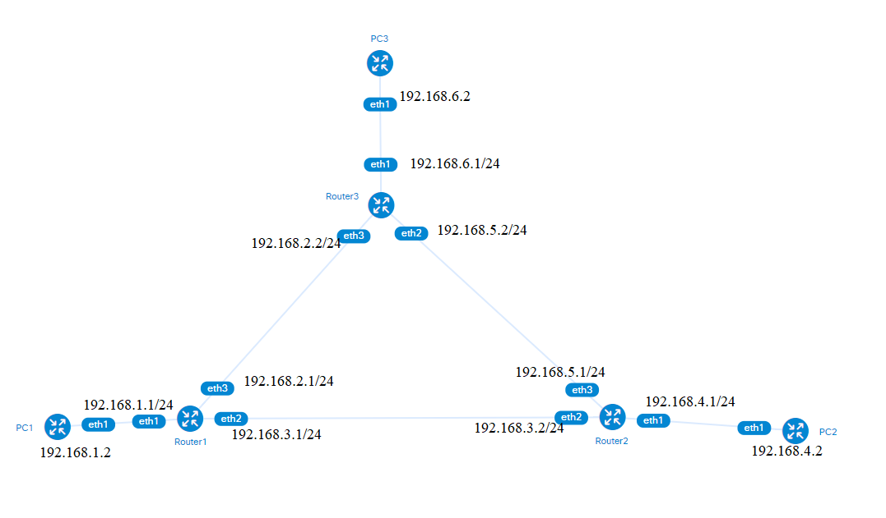

# Basic Networking with Containerlab

In this lab, we will configure a simple network topology with Contailerlab (https://containerlab.dev/) and test the connectivity between each device. To deploy the network components based on Containerlab, we first need to install Docker and Containlab. Refer to the installation guide on the Edge onboarding Wiki ([https://git.inf.fh-dortmund.de/01/smart-edge-lab/edge-onboarding/-/wikis/CONTAINERlab](https://git.inf.fh-dortmund.de/01/smart-edge-lab/edge-onboarding/-/wikis/CONTAINERlab)) or the official Containerlab guide: [https://containerlab.dev/install/](https://containerlab.dev/install/)

## Topology 1



 In this topology, we use two routers (FRR-routers) and four PCs connected to the network. Since all devices are containerized, we need appropriate images to create the containers. For the routers, we utilize official docker FRR router images, but we have to prepare customized Ubuntu docker images for our PCs.

## Prepare Ubuntu docker images
Within the 'PCs' folder, you'll find a Dockerfile containing a sample configuration to build the Ubuntu image.
To create the image issue the follwing command inside the PCs folder :
```
docker build --no-cache -t pcimages
```
This command creates an Ubuntu docker image, which will be used to create Ubuntu containers in our topology.

## Configuring routers

To prepare for the deployment of our network topology, we need to configure our routers. In the Router1 and Router2 folders, you'll find the startup configuration files for each router. You can create and utilize different configuration files as the specific topology requires. Instead of static routing, we chose OSPF as our routing protocol in this topology since more networking devices will be introduced in the future. 
**Router_1 configuration file**
```
frr version 7.5.1_git
frr defaults traditional
hostname Router_1
no ipv6 forwarding
!
interface eth1
 ip address 192.168.1.1/24
!
interface eth2
 ip address 192.168.3.1/24
!
interface eth3
 ip address 192.168.2.1/24
!
router ospf 
network 192.168.1.0/24 area 0
network 192.168.2.0/24 area 0
network 192.168.3.0/24 area 0
!
line vty
!
```
Mainly, we configure router interfaces with IP addresses and configure OSPF accordingly.
## Preparing the network topology
Containerlab uses a YAML file specifying your network's networking and user devices, their configurations, and how they are connected. When you deploy the topology, Containelab creates docker containers for each node and connects them together. Let's look at our topology, which is defined in the  topology1.yml file.
```
name: topology1
topology:
  nodes:
    Router1:
      kind: linux
      image: frrouting/frr:v7.5.1
      binds:
        - Router1/daemons:/etc/frr/daemons
        - Router1/router1.conf:/etc/frr/frr.conf  #router 1 configuration
    Router2:
      kind: linux
      image: frrouting/frr:v7.5.1
      binds:
        - Router2/daemons:/etc/frr/daemons
        - Router2/router2.conf:/etc/frr/frr.conf  #router 2 configuration
    ### Your PC 1
    PC1:
       kind: linux
       image: pcimages:latest  ### Image that we built at the beginning
       exec: 
          - ifconfig eth1 192.168.1.2 netmask 255.255.255.0
          - ip route del default
          - ip route add default via 192.168.1.1 dev eth1
   ---
   ---
   ----
   ## Defining how devices are connected 
  links:
   
    - endpoints: ["PC1:eth1", "Router1:eth1"]   
    - endpoints: ["PC2:eth1", "Router1:eth3"] 
    - endpoints: ["Router1:eth2", "Router2:eth2"]  
    - endpoints: ["PC3:eth1", "Router2:eth1"]  
    - endpoints: ["PC4:eth1", "Router2:eth3"] 
```
We have two routers and use official images to create router container nodes. Each router has a configuration file (inside Router1 and Router2 folders) that will be used as a startup configuration during the bootup. Then, you can see the configurations of user devices (our four PCs). We use custom-built images to create the PC's container. Also, we can add the IP configuration for each PC's network interface here. You can see the endpoints at the bottom of the topology1.yml, defining how each device is connected. 
## Deploy the topology
Use the following command
```
containerlab  deploy  -t topology1.yml
```
Now, you'll see a summary table displaying the deployed lab nodes. This table will include the node name (which corresponds to the container name), node type, image name, and various other useful details.



You can also view the topology using a web browser. To do this, issue the following command and navigate to the provided URL.
```
containerlab graph -t  topology1.yml
```


You can access the shell of any running container node with the following command
`docker exec -ti your-container-name sh`
For example, to access your PC1 and test the connectivity with PC4
```
docker exec -ti clab-topology1-PC1 sh`
```


Also to access the Router_1
```
docker exec -ti clab-topology1-Router1  vtysh
```


## Destroy the topology

Once you deploy, you must destroy the topology before deploying it again.
```
containerlab destroy --topo topology1.yml
```
**That's all folks!**
The next step is to add a new router to the topology and configure it. Ultimately, all devices should be able to communicate with one another. Please refer to the topology2 for more details and name your new topology file as "topology2.yml" for clarity.




